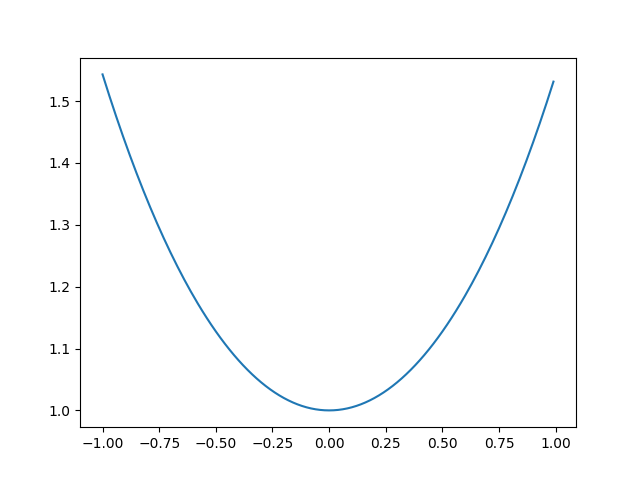
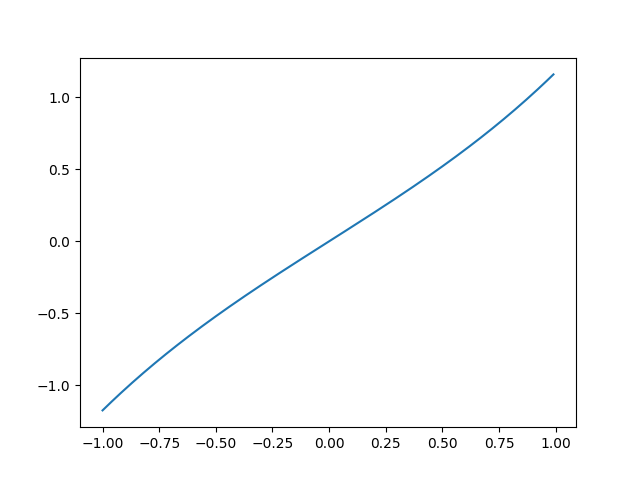
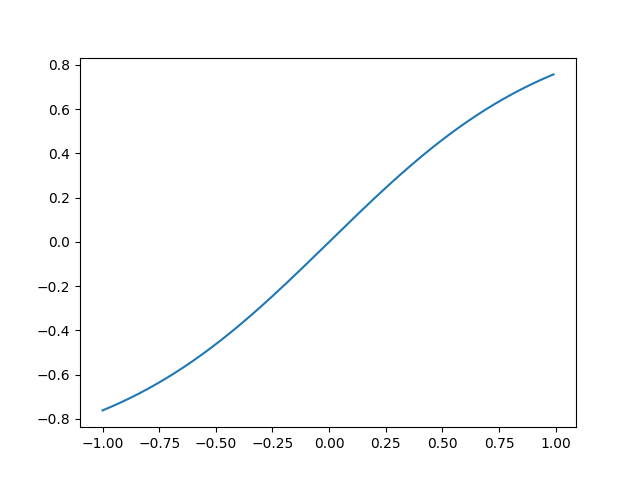
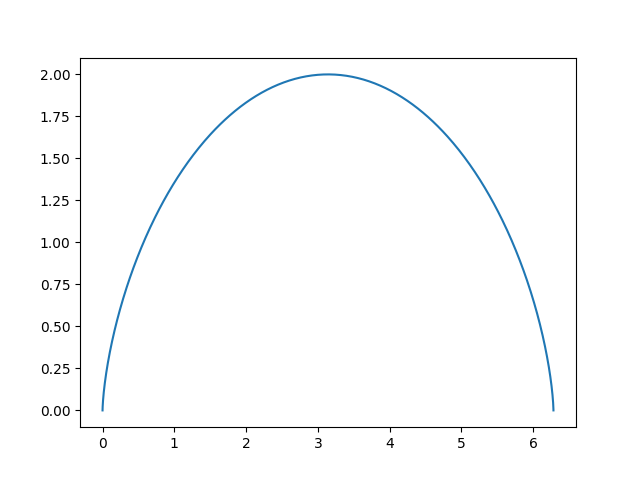
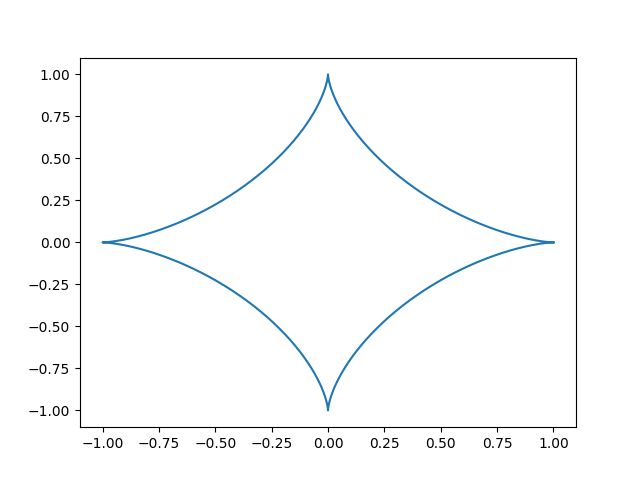
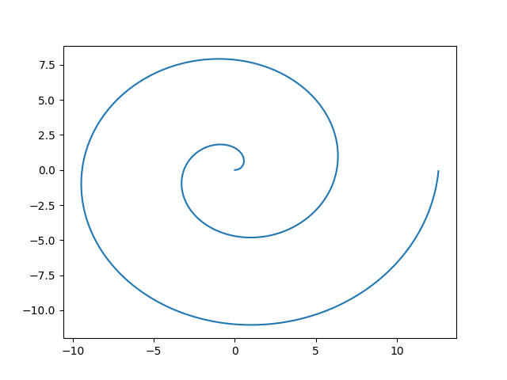
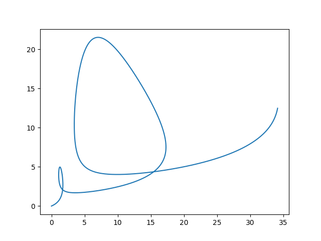
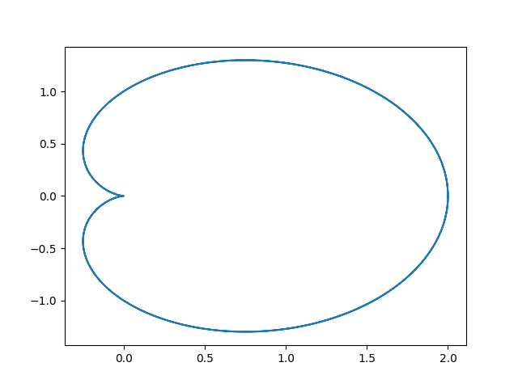
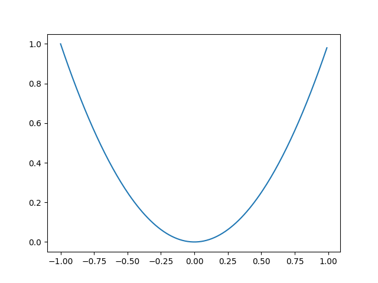
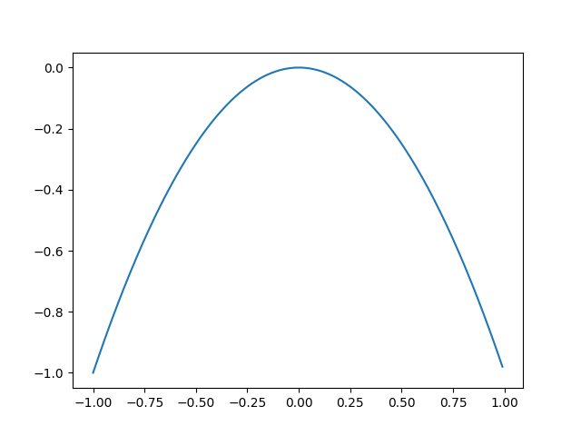

# 重点
## 介值定理
## 微分中值定理
## 微积分第一中值定理
# 函数、极限与连续
## 反函数
## 双曲函数
### 双曲余弦
$$ch(x)=\frac{e^x+e^{-x}}{2}$$

### 双曲正弦
$$sh(x)=\frac{e^x-e^{-x}}{2}$$

### 双曲正切
$$ th(x)=\frac{e^x-e^{-x}}{e^x+e^{-x}}$$

**thx<1**
### 特殊函数图像
#### 摆线方程
$$x=a(t-sin(t))$$
$$y=a(1-cost)$$

#### 星形线
$$x=a(cost)^3$$
$$y=a(sint)^3$$

#### 螺旋线
$$\rho=\theta$$

#### 对数螺旋线
$$\rho=e^{a\theta}$$

#### 心形线
$$\rho=a(1+cos\theta)$$

#### 双纽线
## 数列极限
### 利用$\epsilon-N$证明
1. 假设极限为A
2. 对于$\forall\epsilon>0$,只要N=$f(\epsilon)$,总有
3. |$y_n-A$|<$\epsilon$
4. 则数列极限为A
### 利用$\epsilon-\$
## 夹逼定理
若
$$g(x)<=f(x)<=h(x)$$
$$\lim_{x\to x_0}g(x)=A,\lim_{x\to x_0}h(x)=A$$
则
$$\lim_{x\to x_0}f(x)=A$$
### 重要极限
$$\lim_{x\to 0}\frac{sinx}{x}=1$$
$$\lim_{x\to 0}(1+x)^x=e$$
## 单调有界准则
**重要**
1. 先证数列单调
2. 再证数列存在上下界
### 典型例题
## 无穷小的比较
1. $\lim\frac{\beta}{\alpha}=0,则\beta是\alpha的高阶无穷小$
2. 等价无穷小
3. 同阶无穷小
4. $\lim_{x\to x_0}\frac{\alpha}{(x-x_0)^k}=C则\alpha为(x-x_0)的k阶无穷小$
## 连续
*函数左极限与有极限相等则连续*
## 间断点
**f(x)不连续的点为间断点**
### 第一类间断点
1. 左右极限存在，则为第一类间断点
- 左右极限相等，则为可去间断点
### 第二类间断点
**不是第一类间断点的都是第二类间断点**
# 导数与微分
1. 直接求导数
2. 根据定义求导数
3. 可导一定连续，连续不一定可导
## 反函数求导法则
**$以求\arcsin{x}为例$
1. $y=\arcsin{x}$
2. $x=siny$
3. $\frac{dx}{dy}=cosy$
4. $\frac{dy}{dx}=\frac{1}{cosy}$
5. 将y用x替换
6. $cosy=\sqrt{1-(siny)^2}$
7. $siny=x$
8. $\frac{dy}{dx}=\frac{1}{\sqrt{1-x^2}}$
## 重要求导公式
1. $tanx=\frac{1}{(cosx)^2}$
2. $cotx=-\frac{1}{(sinx)^2}$
3. $\arctan{x}=\frac{1}{1+x^2}$
4. $arccot{x}=-\frac{1}{1+x^2}$
5. $ln(x+\sqrt{x^2+1})=\frac{1}{\sqrt{x^2+1}}$
## 隐函数求导法则
1. 课本知识
2. $y’=\frac{f(y)'}{f(x)'}$暂时求一阶，二阶未验证
## 对数求导法
$$f(x)=x^x$$
$$lnf(x)=xlnx$$
$$两边分别求导$$
$$\frac{f'(x)}{f(x)}=lnx+1$$
$$f'(x)=x^x(lnx+1)$$
## 参数方程求导
$$\begin{cases}
y=y(t)\\
x=x(t)\\
\end{cases}
$$
### 参数方程求一阶导数
$$y'=\frac{y'(t)}{x'(t)}$$
### c参数方程求一阶导数
$$ y''=\frac{y'}{x'(t)}$$
**以上所求导数为y关于t的导数**
## 极坐标求导
*转化为参数方程，剩余过程相同*
## 相关变化率约等于导数
## 高阶导数
### 重要高阶导数
1. $$y=\frac{1}{ax+b}$$
$$y^{(n)}=\frac{(-1)^na^nn!}{(ax+b)^{n+1}}$$
2. $$y=sinx$$
$$y^{(n)}=sin(x+\frac{n\pi}{2})$$
3. $$y=cosx$$
$$  y^{(n)}=cos(x+\frac{n\pi}{2})$$
4. $$(uv)^{(n)}=\sum_{k=0}^n=C_n^ku^{(n-k)}v^{(k)}$$
## 微分应用
$$\epsilon(y_0)=|f'(x_0)|\epsilon(x_0)$$ 
# 微分中值定理与导数
## 函数驻点
**导数为0的点为驻点**
## 函数凹凸性
### 凹函数
$$y''>0$$
$$y=x^2$$
$$f(\frac{x_1+x_2}{2})<\frac{f(x_1)+f(x_2)}{2}$$

### 凸函数
$$y''<0$$
$$y=-x^2$$
$$f(\frac{x_1+x_2}{2})>\frac{f(x_1)+f(x_2)}{2}$$

### 拐点
凹函数与凸函数的分界点
$$f''(x)=0,且该点发生变号$$
## 渐近线
### 垂直渐近线 x=a
### 一般渐近线 y=kx+b
1. 先求$\lim_{x\to \infty}\frac{f(x)}{x}=k$
2. 再求$\lim_{x\to \infty}f(x)-kx=b$
## 曲线曲率
### 弧微分
- 直角坐标系
$$ds=\sqrt{(1+(y')^2}dx$$
- 极坐标
$$ds=\sqrt{(x'(t))^2+(y'(t))^2}dt$$
- 极坐标
$$ds=\sqrt{(\rho(\theta))^2+(\rho'(\theta))^2}d\theta$$
### 曲率
$$K=\frac{|y''|}{(1+(y')^2)^{\frac{3}{2}}}$$
$$r=\frac{1}{K}$$
### 曲率圆
两曲线在某一点具有相同的曲率圆
1. g(x)=f(x)
2. g'(x)=f'(x)
3. g''(x)=f''(x)
### 曲率中心
$$\begin{cases}
x_0=x-\frac{y'(1+(y')^2)}{y''}\\
y_0=y+\frac{1+(y')^2}{y''}\\
\end{cases}
$$
## 泰勒公式
1. 皮亚诺余项 $o((x-x_0)^{k+1})$
2. 拉格朗日余项 $\frac{f^{(k+1)}(\zeta)}{(k+1)!}(x-x_0)^{k+1}$
## 麦克劳林公式
$$e^x=1+x+\frac{x^2}{2!}+\frac{x^3}{3!}+.....$$
$$ln(1+x)=x-\frac{x^2}{2}+\frac{x^3}{3}+...$$
$$(1+x)^a=1+ax+\frac{a(a-1)}{2!}x^2+\frac{a(a-1)(a-2)}{3!}x^3+...$$
$$sinx=x-\frac{x^3}{3!}+\frac{x^5}{5!}+...$$
$$cosx=1-\frac{x^2}{2!}+\frac{x^4}{4!}+...$$
$$tanx=x+\frac{1}{3}x^3+\frac{2}{15}x^5+...$$
# 定积分与不定积分
**不定积分要加C**
## 估值定理
## 积分中值定理
## 基本积分公式
[高等数学积分表](https://wenku.baidu.com/view/9ff348a20029bd64783e2c24.html/)
$$ \int \frac{1}{\sqrt{x^2+1}}=ln(x+\sqrt{x^2+1})+C$$
$$ \int \frac{1}{\sqrt{x^2-1}}=ln(x+\sqrt{x^2-1})+C$$
## 第一换元法
## 第二换元法
## 有理函数积分
$$\frac{P(x)}{Q(x)}=\frac{A_1}{x-a}+\frac{A_2}{(x-a)^2}+...\frac{C_1x+D_1}{x^2+px+q}+\frac{C_2x+D_2}{(x^2+px+q)^2}+...$$
## 三角函数有理式积分
$$u=tan\frac{x}{2}$$
$$sinx=\frac{2u}{u^2+1}$$
$$cosx=\frac{1-u^2}{1+u^2}$$
$$dx=\frac{2}{1+u^2}du$$
## 分部积分
$$\int uv'dx=uv-\int u'vdx$$
$$\int udv=uv-\int vdu$$
## 周期函数定积分
## 反常积分
### 无穷积分
### 瑕积分
从瑕点断开分别积分
## 定积分的应用
### 求旋转体体积
1. 柱壳法
$$v=\int 2\pi df(x)dx$$
d为当前坐标到旋转轴的距离
$$一般地，v=\int 2\pi xf(x)dx$$
2. 截面法
$$v=\int \pi{f(x)}^2dx$$
### 极坐标下曲线几何
1.弧长
$$ds=\int \sqrt{{\rho(\theta)}^2+{\rho'(\theta)}^2}d\theta$$
2.面积
$$ds=\int \frac{1}{2}{\rho(\theta)}^2d\theta$$
# 常微分方程
## 可分离变量
## 换元法（齐次式）
1. $u=x+y$
$$\frac{du}{dx}=1+\frac{dy}{dx}$$
2. $u=\frac{y}{x}$
$$\frac{dy}{dx}=\frac{du}{dx}+u$$
3. $u=\frac{ay+b}{cx+z}$
凑数变成标准情况
4. $求\frac{dx}{dy}$
## 一阶线性微分方程
### 齐次
$$\frac{dy}{dx}+P(x)y=0$$
分离变量求解
### 非齐次
$$\frac{dy}{dx}+P(x)y=Q(x)$$
$$y=e^{-\int P(x)dx}[C+\int Q(x)e^{\int P(x)dx}]$$
### 伯努利方程
$$\frac{dy}{dx}+P(x)y=Q(x)y^n$$
$$令u=y^{1-n}$$
### $y''=f(x,y')$
令p=y'
### $y''=f(y,y')$
$$令p=y' 则y''=p\frac{dp}{dy}$$
## 二阶方程
$$y''+p(x)y'+q(x)y=0$$
### 线性
1. $猜出y_1$
- 常用解
- $e^x$
- $x$
- $x^k$
- $lnx$
2. $根据刘维尔公式求y_2$
$$y_2=y_1\int \frac{e^{-\int p(x)dx}}{y_1}dx$$
$$y=C_1y_1+C_2y_2$$
### 非线性
$$y''+p(x)y'+q(x)y=f(x)$$
1. $先求线性通解y_1,y_2$
2. 根据公式
$$C_1(x)=-\int \frac{y_2f(x)}{v(y_1,y_2)}dx$$
$$C_2(x)=\int \frac{y_1f(x)}{v(y_1,y_2)}$$
$$v(y_1,y_2)=y_1y_2'-y_2y_1'$$
## 常系数线性齐次微分方程
$$y''+a_1y'+a_2y=0$$
解方程
1. 两个解
   $$y=C_1e^{r_1x}+C_2e^{r_2x}$$
2. 一个解
   $$另一个解使用刘维尔公式$$
   $$y=e^{rx}(C_1+C_2x)$$
3. 无解
   $r_1=a+ib,r_2=a-ib$
   $$e^{i\theta}=cos\theta+isin\theta$$
   $$y=C_1e^{ax}cosbx+C_2e^{ax}sinbx$$
## 常系数线性非齐次微分方程
$$Q''(x)+(2\lambda+a_1)Q'(x)+(\lambda^2+a_1\lambda+a_2)Q(x)=P_m(x)$$
1. $自由项为P_m(x)e^{\lambda x}$
2. 设多项式Q(x)代入
### $自由项为cosbxP_m(x)e^{ax}$
1. $转化为P_m(x)e^{(a+ib)x}$
2. 求Q(x),转化后取实部
3. 若为sinx，则取虚部
## 欧拉方程
$$x^ny^{(n)}+a_1x^{n-1}y^{(n-1)}+……=f(x)$$
$$令x=e^t,t=lnx$$
$$x^ky^{(k)}=D(D-1)...(D-k+1)y$$
$$Dy=y',D^2y=y'',D^3y=y'''$$
$$求出y关于t的表达式然后代换$$
## 微分方程组
$$
\begin{cases}
\frac{dy}{dx}=3y-2z\\
\frac{dz}{dx}=2y-z\\
\end{cases}
$$
$$y=\frac{1}{2}[\frac{dz}{dx}+z]③$$
$$代入得,z''-2z'+z=0$$
$$求出z=(C_1+C_2x)e^x$$
$$将z代入③,得y$$

